# Trabalho 6 – Comparação de Tecnologias de Invocação de Serviços Remotos

> Implementação e benchmarking de um serviço de catálogo de músicas em **8 variações** — 4 protocolos × 2 linguagens — com testes de carga via Locust.

## Integrantes

| Nome | Matrícula |
|------|-----------|
| Pedro Diógenes | 2315029 |
| Matheus Vasconcelos | 2315043 |
| Erich Lima | 2310362 |
| Rebeca Vicente | 2122489 |

---

## Tecnologias Implementadas

| # | Serviço | Protocolo | Linguagem | Porta | Framework |
|---|---------|-----------|-----------|-------|-----------|
| 1 | `go-rest` | REST / HTTP | Go | 8001 | `net/http` |
| 2 | `go-graphql` | GraphQL | Go | 8002 | `graph-gophers/graphql-go` |
| 3 | `go-grpc` | gRPC | Go | 8003 | `google.golang.org/grpc` |
| 4 | `go-soap` | SOAP 1.1 | Go | 8004 | `encoding/xml` |
| 5 | `python-rest` | REST / HTTP | Python | 8011 | Flask |
| 6 | `python-graphql` | GraphQL | Python | 8012 | Strawberry + Flask |
| 7 | `python-grpc` | gRPC | Python | 8013 | `grpcio` |
| 8 | `python-soap` | SOAP 1.1 | Python | 8014 | Spyne |

Todos os serviços compartilham um único **PostgreSQL** com 300 usuários · 500 músicas · 100 playlists.

---

## Estrutura do Repositório

```
NABORTRAB6/
├── docker-compose.yml         ← 9 containers (8 serviços + PostgreSQL)
├── init.sql                   ← schema + seed
├── music.proto                ← contrato gRPC compartilhado
├── run_benchmarks.py          ← runner de testes + geração de gráficos
│
├── go/{rest,graphql,grpc,soap}/    ← main.go · go.mod · Dockerfile
├── python/{rest,graphql,grpc,soap}/ ← app.py · requirements.txt · Dockerfile
├── locust/                    ← locustfiles por protocolo
└── results/                   ← CSVs e gráficos (gerados automaticamente)
```

---

## CRUD Implementado

Todos os 8 serviços expõem operações completas para `songs`, `users` e `playlists`:

| Operação | REST | GraphQL | gRPC | SOAP |
|----------|------|---------|------|------|
| Listar | `GET /songs` | `query { songs }` | `ListSongs` | `<ListSongs/>` |
| Buscar por ID | `GET /songs/{id}` | `query { song(id: N) }` | `GetSong` | `<GetSong>` |
| Criar | `POST /songs` | `mutation { create_song }` | `CreateSong` | `<CreateSong>` |
| Atualizar | `PUT /songs/{id}` | `mutation { update_song }` | `UpdateSong` | `<UpdateSong>` |
| Deletar | `DELETE /songs/{id}` | `mutation { delete_song }` | `DeleteSong` | `<DeleteSong>` |

---

## Como Executar

### 1. Subir os serviços

```bash
docker compose up --build -d
```

> Na primeira vez demora ~2–5 min (build das imagens + PostgreSQL inicializar).

### 2. Verificar se estão no ar

```bash
curl http://localhost:8001/health   # go-rest      → {"status":"ok"}
curl http://localhost:8011/health   # python-rest  → {"status":"ok"}
```

### 3. Instalar dependências para os testes (apenas uma vez)

```bash
pip install locust matplotlib pandas requests grpcio grpcio-tools
```

### 4. Rodar os testes de carga

```bash
# Tudo (8 serviços × 3 níveis)
python run_benchmarks.py

# Filtrar por linguagem
python run_benchmarks.py --tech go
python run_benchmarks.py --tech python

# Filtrar por protocolo
python run_benchmarks.py --api rest
python run_benchmarks.py --api grpc,graphql

# Um serviço específico
python run_benchmarks.py --tech go --api rest

# Só carga alta
python run_benchmarks.py --load high

# Só regerar gráficos (sem rodar locust)
python run_benchmarks.py --charts-only
```

Os resultados ficam em `results/`.

### 5. Parar tudo

```bash
docker compose down
```

---

## Metodologia dos Testes

- **Ferramenta:** [Locust](https://locust.io/) rodando no host contra `localhost:PORT`
- **Workload:** leitura intensiva — `GetSong` (5×) · `ListSongs` (3×) · `GetUser` (3×) · `ListUsers` (2×) · `GetPlaylist` (3×) · `ListPlaylists` (2×) · `GetPlaylistSongs` (2×)
- **gRPC:** via cliente nativo `grpc.insecure_channel` (não usa HttpUser)
- **Escala log:** usada nos gráficos de p95 para não distorcer a visualização com o outlier do `python-soap`

### Níveis de Carga

| Nível | Usuários simultâneos | Taxa de spawn | Duração |
|-------|---------------------|---------------|---------|
| low | 50 | 10/s | 30 s |
| medium | 200 | 20/s | 45 s |
| high | 500 | 50/s | 60 s |

---

## Resultados

### Throughput – Requisições por segundo (maior = melhor)

| Serviço | 50u | 200u | 500u |
|---------|----:|-----:|-----:|
| go-rest | 151 | 579 | 728 |
| go-graphql | 133 | 504 | 684 |
| go-grpc | 151 | 564 | **772** |
| go-soap | 133 | 499 | 682 |
| python-rest | 149 | 543 | 677 |
| python-graphql | 131 | 492 | 645 |
| python-grpc | 152 | 521 | 558 |
| python-soap | 7 | — ⚠ | 7 |

### Latência p95 em ms (menor = melhor)

| Serviço | 50u | 200u | 500u |
|---------|----:|-----:|-----:|
| go-rest | 12 | 20 | 520 |
| go-graphql | 56 | 70 | 460 |
| go-grpc | 27 | 69 | 620 |
| go-soap | 56 | 86 | 480 |
| python-rest | 19 | 100 | 530 |
| python-graphql | 62 | 120 | 580 |
| python-grpc | 12 | 150 | 960 |
| python-soap | 7300 | — ⚠ | 12000 |

### log₁₀(p95) — mesma tabela em escala logarítmica

| Serviço | 50u | 200u | 500u |
|---------|----:|-----:|-----:|
| go-rest | 1.079 | 1.301 | 2.716 |
| go-graphql | 1.748 | 1.845 | 2.663 |
| go-grpc | 1.431 | 1.839 | 2.792 |
| go-soap | 1.748 | 1.934 | 2.681 |
| python-rest | 1.279 | 2.000 | 2.724 |
| python-graphql | 1.792 | 2.079 | 2.763 |
| python-grpc | 1.079 | 2.176 | 2.982 |
| python-soap | **3.863** | — ⚠ | **4.079** |

> ⚠ `python-soap` medium: dado ausente por falha no servidor durante o teste. O `wsgiref.simple_server` do Spyne é single-threaded — qualquer carga derruba o serviço.

---

### Evolução com a Concorrência

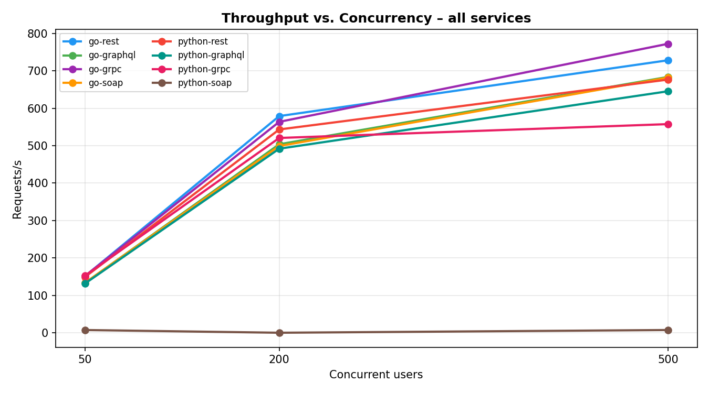

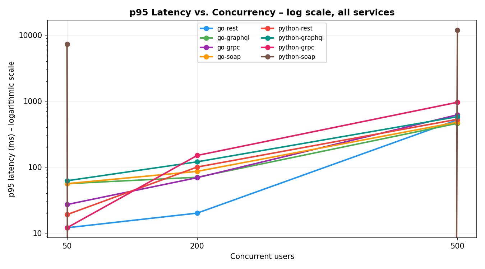

---

### Por Protocolo: Go vs Python

#### REST

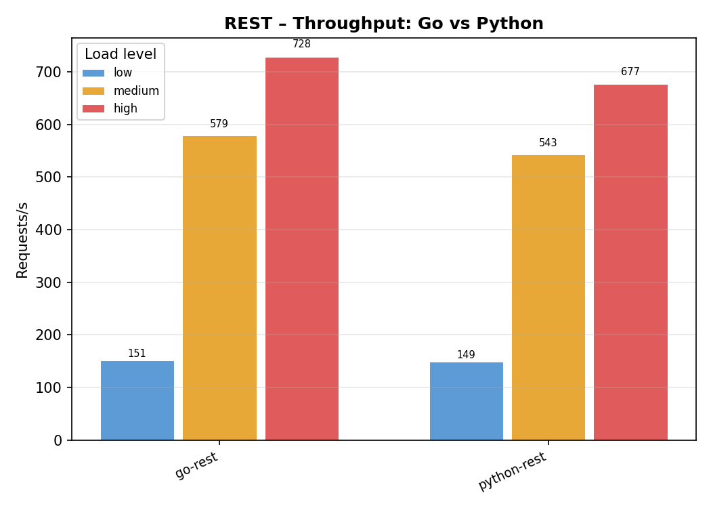

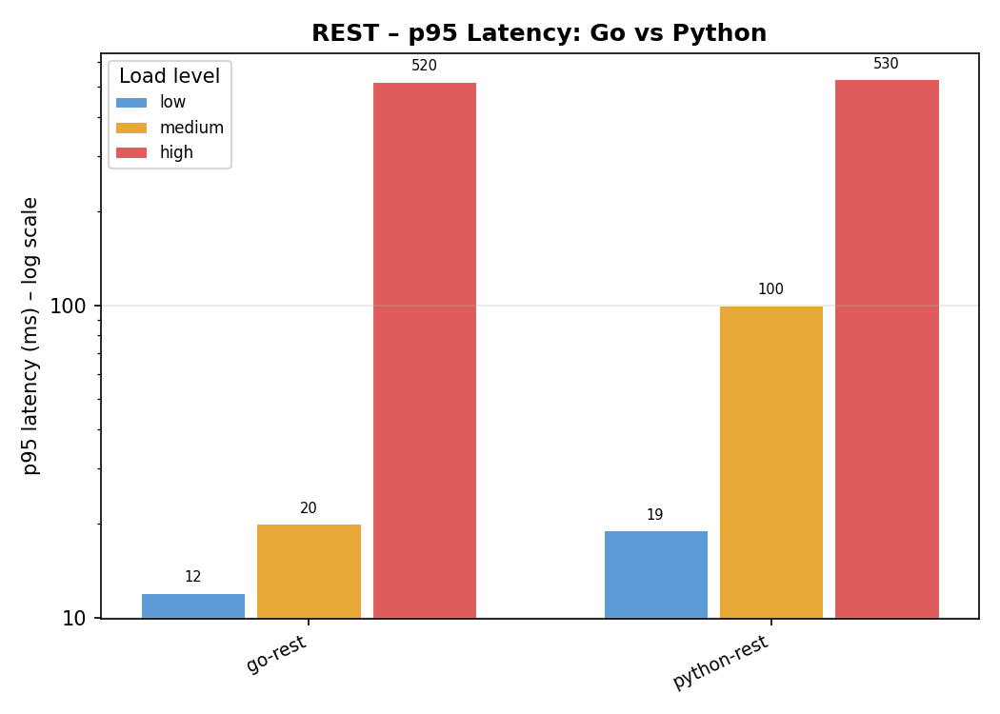

#### GraphQL

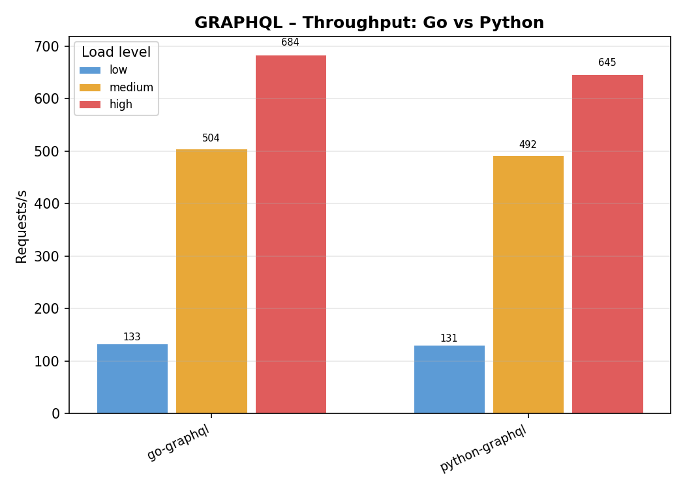

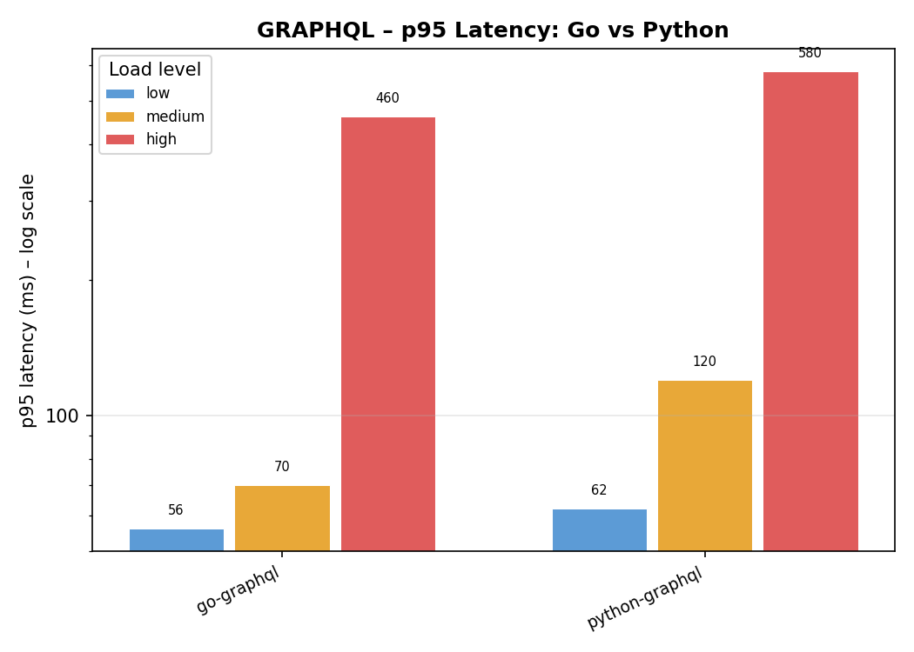

#### gRPC

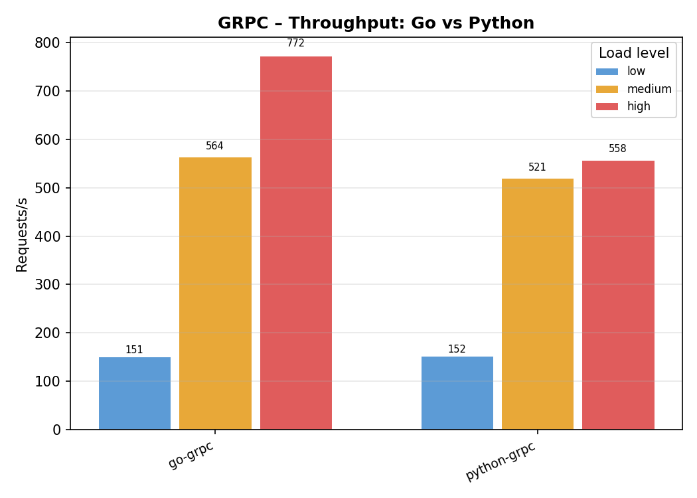

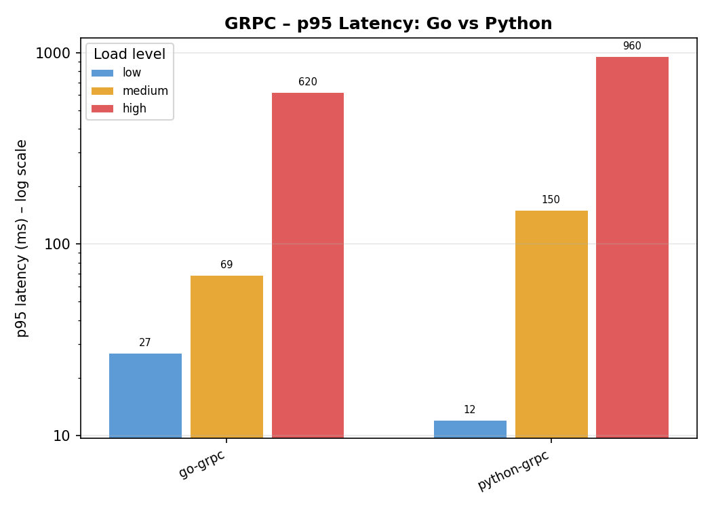

#### SOAP

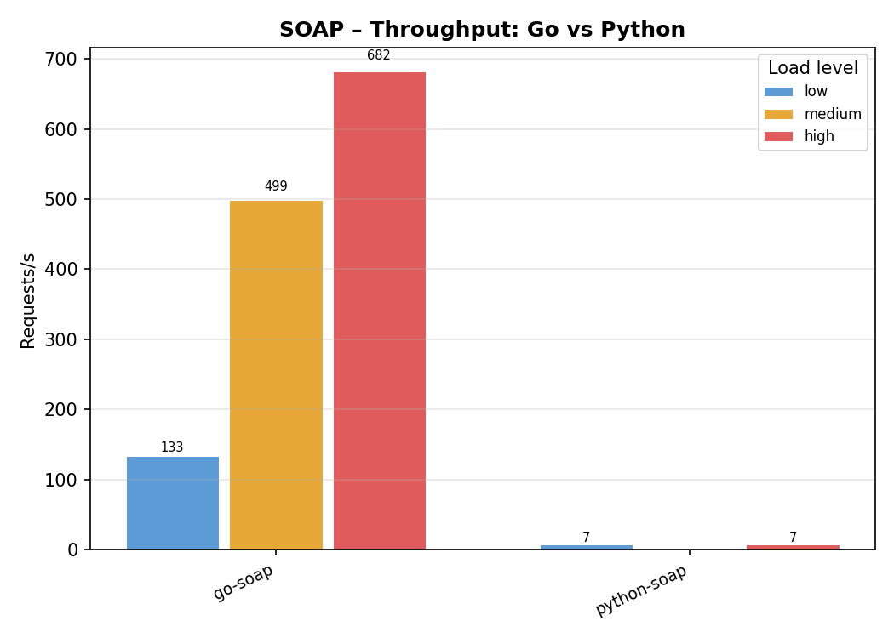

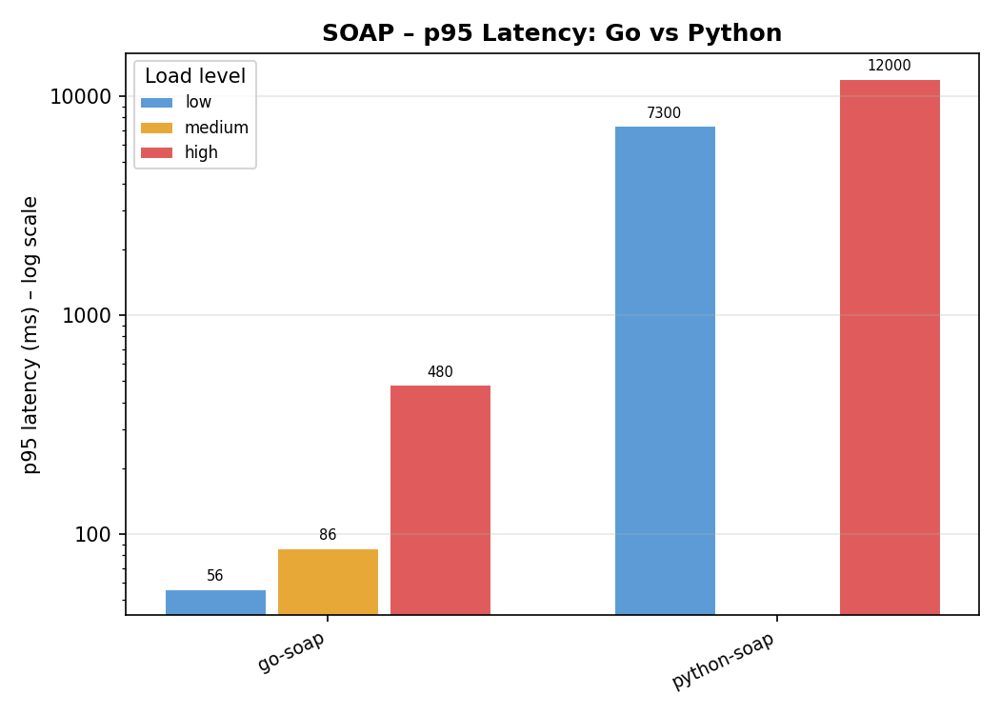

---

### Por Linguagem: todos os protocolos

#### Go

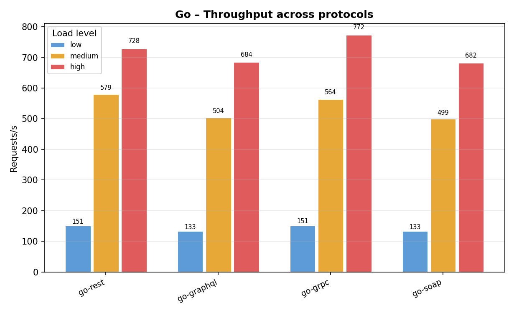

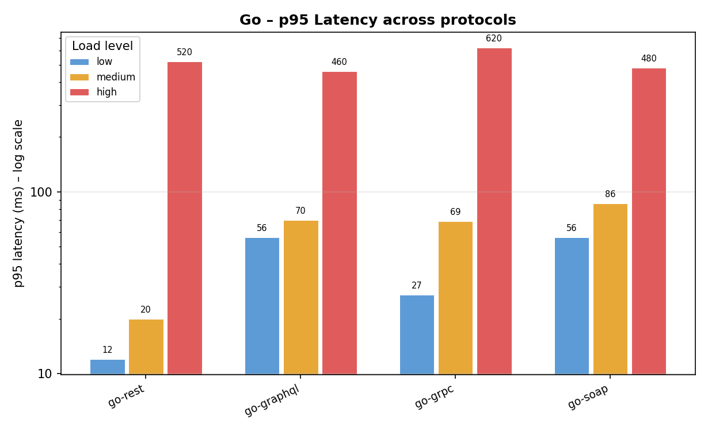

#### Python

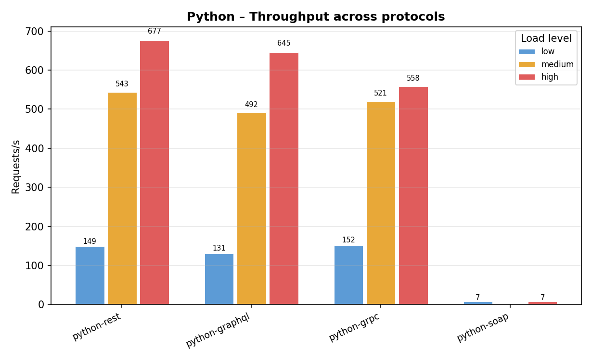

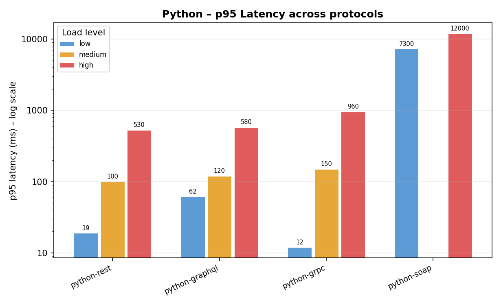

---

## Análise e Conclusões

### Go supera Python em todos os protocolos
Go compila para binário nativo e usa goroutines de custo baixíssimo. Python tem o GIL (*Global Interpreter Lock*), que limita o paralelismo real — resulta em throughput similar em baixa carga mas divergência crescente a 500 usuários.

### REST tem menor overhead entre os protocolos
JSON puro tem a menor sobrecarga de serialização. GraphQL e SOAP fazem parsing mais pesado (AST de query / XML envelope). gRPC adiciona negociação HTTP/2 — tradeoff que só compensa em contratos ricos ou payloads grandes.

### gRPC se destaca em Go, fica atrás em Python
`go-grpc` atingiu **772 RPS** (maior de todos a 500u), aproveitando o multiplexing HTTP/2. Já `python-grpc` apresenta o pior p95 entre os serviços Python (960ms a 500u) — o GIL prejudica o processamento dos frames gRPC.

### python-soap — gargalo arquitetural
O Spyne em `wsgiref.simple_server` é **single-threaded**: uma requisição bloqueia todas as demais. Resultado: ~7 RPS independente da carga (vs ~682 RPS do `go-soap`). Em produção seria resolvido com Gunicorn/uWSGI. A tabela de log₁₀(p95) evidencia o outlier: enquanto todos os outros serviços têm log ~1–3 (10–1000ms), `python-soap` chega a **4.08** (12 segundos).

### Ranking final (500 usuários simultâneos)

```
🥇  go-grpc         772 RPS   p95 =  620ms
🥈  go-rest         728 RPS   p95 =  520ms
🥉  go-soap         682 RPS   p95 =  480ms
 4  go-graphql      684 RPS   p95 =  460ms
 5  python-rest     677 RPS   p95 =  530ms
 6  python-graphql  645 RPS   p95 =  580ms
 7  python-grpc     558 RPS   p95 =  960ms
⚠   python-soap       7 RPS   p95 = 12000ms  ← single-threaded
```

---

## Dependências

- Docker + Docker Compose
- Python 3.10+ (para `run_benchmarks.py` no host)
- `pip install locust matplotlib pandas requests grpcio grpcio-tools`
