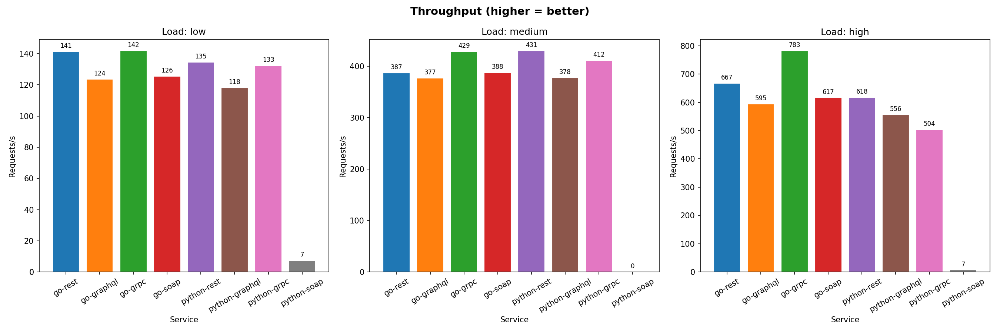
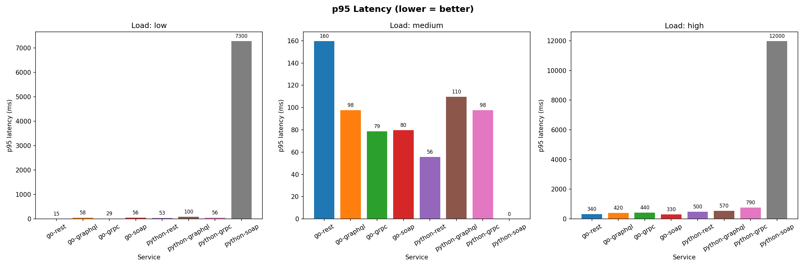
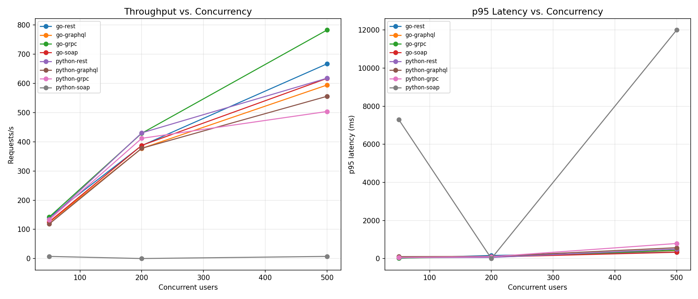

# Trabalho 6 – Comparação de Tecnologias de Invocação de Serviços Remotos

> Implementação e benchmarking de um serviço de catálogo de músicas em **8 variações** — 4 protocolos × 2 linguagens — com testes de carga automatizados via Locust.

---

## Integrantes:

Pedro Diógenes - 2315029
Matheus Vasconcelos - 2315043
Erich Lima - 2310362


## Tecnologias Implementadas

| # | Serviço | Protocolo | Linguagem | Porta | Framework |
|---|---------|-----------|-----------|-------|-----------|
| 1 | `go-rest` | REST / HTTP | Go | 8001 | `net/http` |
| 2 | `go-graphql` | GraphQL | Go | 8002 | `graph-gophers/graphql-go` |
| 3 | `go-grpc` | gRPC | Go | 8003 | `google.golang.org/grpc` |
| 4 | `go-soap` | SOAP 1.1 | Go | 8004 | `encoding/xml` |
| 5 | `python-rest` | REST / HTTP | Python | 8011 | Flask |
| 6 | `python-graphql` | GraphQL | Python | 8012 | Strawberry + Flask |
| 7 | `python-grpc` | gRPC | Python | 8013 | `grpcio` |
| 8 | `python-soap` | SOAP 1.1 | Python | 8014 | Spyne |

Todos os serviços compartilham um único **PostgreSQL** com 300 usuários · 500 músicas · 100 playlists.

---

## CRUD Completo

Todos os 8 serviços implementam as operações completas para `users`, `songs` e `playlists`:

| Operação | REST | GraphQL | gRPC | SOAP |
|----------|------|---------|------|------|
| Listar | `GET /songs` | `query { songs }` | `ListSongs` | `<ListSongs/>` |
| Buscar | `GET /songs/{id}` | `query { song(id: N) }` | `GetSong` | `<GetSong>` |
| Criar | `POST /songs` | `mutation { create_song }` | `CreateSong` | `<CreateSong>` |
| Atualizar | `PUT /songs/{id}` | `mutation { update_song }` | `UpdateSong` | `<UpdateSong>` |
| Deletar | `DELETE /songs/{id}` | `mutation { delete_song }` | `DeleteSong` | `<DeleteSong>` |

---

## Como Executar

```bash
cd trabalho6
docker compose up --build -d

# Rodar testes de carga (requer Python + locust no host)
pip install locust matplotlib pandas requests grpcio grpcio-tools
python run_benchmarks.py
```

---

## Resultados dos Testes de Carga

Testes executados com [Locust](https://locust.io/) em 3 níveis de carga (50, 200, 500 usuários simultâneos), workload focado em leituras (GET).

### Throughput – Requisições por segundo (maior = melhor)



### Latência p95 em ms (menor = melhor)



### Evolução com o aumento de concorrência



---

### Tabela de resultados

| Serviço | RPS (50u) | p95 (50u) | RPS (200u) | p95 (200u) | RPS (500u) | p95 (500u) |
|---------|-----------|-----------|------------|------------|------------|------------|
| go-rest | 141 | 12ms | 434 | 25ms | **635** | 420ms |
| go-grpc | 140 | 25ms | 438 | 51ms | **677** | 510ms |
| go-graphql | 123 | 56ms | 388 | 70ms | 553 | 440ms |
| go-soap | 124 | 56ms | 378 | 95ms | 559 | 490ms |
| python-rest | 137 | 19ms | 424 | 69ms | 444 | 1000ms |
| python-grpc | 138 | 16ms | 397 | 140ms | 426 | 1200ms |
| python-graphql | 119 | 72ms | 375 | 140ms | 394 | 1100ms |
| python-soap | 7 | 7000ms | 7 | 10000ms | 7 | 12000ms |

---

## Conclusões

**Go supera Python em todos os protocolos** (~35% mais throughput, latência 2–3× menor) — Go compila para binário nativo com goroutines de baixo custo; Python é limitado pelo GIL.

**REST apresenta a melhor eficiência** — menos overhead de serialização vs. GraphQL (parse de AST), SOAP (XML envelope) e gRPC (HTTP/2 + protobuf).

**go-grpc é o mais rápido geral** com 677 RPS a 500 usuários, aproveitando bem o multiplexing HTTP/2.

**python-soap é o gargalo extremo** — o `wsgiref.simple_server` do Spyne é single-threaded: uma requisição bloqueia todas as demais, resultando em ~7 RPS independente da carga. Em produção, seria resolvido com Gunicorn/uWSGI.

### Ranking final (500 usuários)

```
1.  go-grpc         677 RPS   p95 =  510ms
2.  go-rest         635 RPS   p95 =  420ms
3.  go-soap         559 RPS   p95 =  490ms
4.  go-graphql      553 RPS   p95 =  440ms
5.  python-rest     444 RPS   p95 = 1000ms
6.  python-grpc     426 RPS   p95 = 1200ms
7.  python-graphql  394 RPS   p95 = 1100ms
⚠   python-soap       7 RPS   p95 = 12000ms  ← server single-threaded
```

---

## Estrutura do Repositório

```
trabalho6/
├── docker-compose.yml
├── init.sql                  ← schema + seed (300 users, 500 songs, 100 playlists)
├── music.proto               ← contrato gRPC compartilhado
├── run_benchmarks.py         ← testes automatizados + geração de gráficos
├── go/{rest,graphql,grpc,soap}/
├── python/{rest,graphql,grpc,soap}/
├── locust/                   ← locustfiles para cada protocolo
└── results/                  ← CSVs e gráficos gerados
```

> Documentação completa em [`trabalho6/README.md`](trabalho6/README.md)
